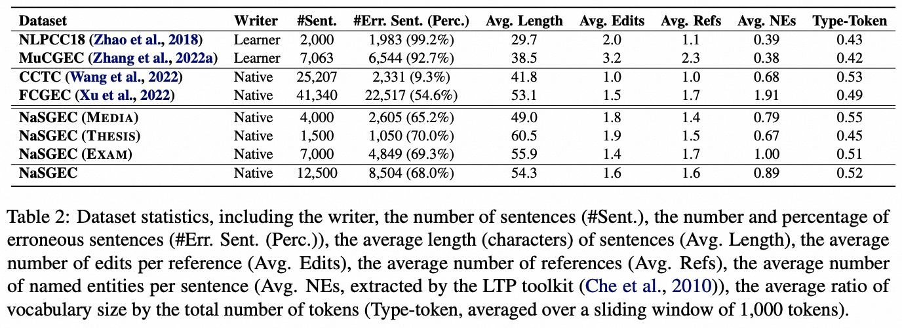

# NaSGEC: a Multi-Domain Chinese Grammatical Error Correction Dataset from Native Speaker Texts

[中文](./README.md)|[English](./README.en.md)

## Introduction
We presents the first multi-domain Chinese grammatical error correction dataset from native speaker texts, NaSGEC, which includes real erroneous sentences from three domains: social media (Media), academic writing (Thesis), and Chinese exams (Exam). The aim is to promote cross-domain research in Chinese grammatical error correction (CGEC). Each erroneous sentence is annotated by two annotators and reviewed by one expert, thus providing multiple high-quality reference corrections.

In addition, we trained a series of high-quality benchmark CGEC models based on Chinese BART, including: 1) training data based on high-quality human annotation (Lang8+HSK); 2) training data automatically constructed from a large-scale (>100 million) native language text corpus.

Furthermore, we also fine-tuned the above models with the manually annotated NaSGEC dataset to build advanced CGEC models for specific domains.

## NaSGEC Dataset
The NaSGEC dataset mainly includes 12,500 sentences and corresponding reference corrections from three Chinese native language domains, namely:

+ **Social Media (NaSGEC-Media)**: 4,000 sentences from articles posted on WeChat official account platform；
+ **Scientific Writing (NaSGEC-Thesis)**：1,500 sentences obtained from undergraduate thesis in computer science；
+ **Chinese Examination (NaSGEC-Exam)**：7,000 sentences obtained from Chinese exam papers；


The main data statistical indicators are shown in the table below:


For more detailed data introduction and cross domain analysis, please refer to our paper.

*Note: the full dataset will be released as soon as possible.*


## Benchmark CGEC Models
### Experimental Enviroment
Our models are developed based on the `SynGEC` code library, and the experimental environment installation is as follows:

```
git clone git@github.com:HillZhang1999/NaSGEC.git
git submodule update --recursive --remote --force
conda create -n nasgec python==3.8
conda activate nasgec
pip install -r requirements.txt
python -m spacy download en
cd ./SynGEC/src/src_syngec/fairseq-0.10.2
pip install --editable ./
```

### Model Usage
We have released the following 5 CGEC models:
| Model | Link |
| :------- | :---------: | 
| **real_learner_bart_CGEC** | [Google Drive](https://drive.google.com/file/d/1AamhBi6vJ8RVzzHtr43Uaoqrm7_vPpuB/view?usp=share_link) | 
| **pseudo_native_bart_CGEC** | [Google Drive](https://drive.google.com/file/d/1dKbrej1Eh_M1DFqtCvvSqso0QUUn9EvC/view?usp=share_link) | 
| **pseudo_native_bart_CGEC_media** | [Google Drive](https://drive.google.com/file/d/17dSnSEPq-eyWZ-Uck4G6fO8XwjNfxmDi/view?usp=share_link) | 
| **pseudo_native_bart_CGEC_thesis** | [Google Drive](https://drive.google.com/file/d/1J-BFDSxV4eQ2JvFEXdvI2AktZOxNd8rq/view?usp=share_link) |
| **real_learner_bart_CGEC_exam** | [Google Drive](https://drive.google.com/file/d/1iQ0i7JMNXyoKjd5BdAfIPGg3QBLr9Lr3/view?usp=share_link) |

In addition to the Fairseq version mentioned above, our models also support `HuggingFace transformers`:

```
from transformers import BertTokenizer, BartForConditionalGeneration, Text2TextGenerationPipeline
tokenizer = BertTokenizer.from_pretrained("/mnt/nas_alinlp/zuyi.bzy/zhangyue/NaSGEC/models/real_learner_bart_CGEC")
model = BartForConditionalGeneration.from_pretrained("/mnt/nas_alinlp/zuyi.bzy/zhangyue/NaSGEC/models/real_learner_bart_CGEC")
encoded_input = tokenizer(["北京是中国的都。", "他说：”我最爱的运动是打蓝球“", "我每天大约喝5次水左右。", "今天，我非常开开心。"], return_tensors="pt", padding=True, truncation=True)
if "token_type_ids" in encoded_input:
    del encoded_input["token_type_ids"]
output = model.generate(**encoded_input)
print(tokenizer.batch_decode(output, skip_special_tokens=True))
```

Hugging Face Models:
| Model | Link |
| :------- | :---------: |
| **HillZhang/real_learner_bart_CGEC** | [HuggingFace](https://huggingface.co/HillZhang/real_learner_bart_CGEC)|
| **HillZhang/pseudo_native_bart_CGEC** | [HuggingFace](https://huggingface.co/HillZhang/pseudo_native_bart_CGEC)|
| **HillZhang/pseudo_native_bart_CGEC_media** | [HuggingFace](https://huggingface.co/HillZhang/pseudo_native_bart_CGEC_media) |
| **HillZhang/pseudo_native_bart_CGEC_thesis** | [HuggingFace](https://huggingface.co/HillZhang/pseudo_native_bart_CGEC_thesis) |
| **HillZhang/real_learner_bart_CGEC_exam** | [HuggingFace](https://huggingface.co/HillZhang/real_learner_bart_CGEC_exam) |


### Performance Evaluation
The metric used in our paper is based on [MuCGEC](https://github.com/HillZhang1999/MuCGEC). The **ChERANT** tool proposed by this work mainly calculates Precision/Recall/F_0.5 at the word level [[Link]](https://github.com/HillZhang1999/MuCGEC/tree/main/scorers/ChERRANT). We will provide an online evaluation website in the future.

In addition, our model can also achieve SOTA performance on previous benchmarks such as NLPCC18/MuCGEC.

## Citation

If you think our work is helpful, please cite our paper:
NaSGEC: a Multi-Domain Chinese Grammatical Error Correction Dataset from Native Speaker Texts (Accepted by ACL2023 Findings) [PDF]()

```
@inproceedings{zhang-etal-2023-nasgec,
    title = "{Na}{SGEC}: a Multi-Domain Chinese Grammatical Error Correction Dataset from Native Speaker Texts",
    author = "Zhang, Yue  and
      Zhang, Bo  and
      Jiang, Haochen  and
      Li, Zhenghua  and
      Li, Chen  and
      Huang, Fei  and
      Zhang, Min"
    booktitle = "Findings of ACL",
    year = "2023"
    }
```

## Connection

If you encounter any issues when using our dataset and code, you can contact hillzhang1999@qq.com.