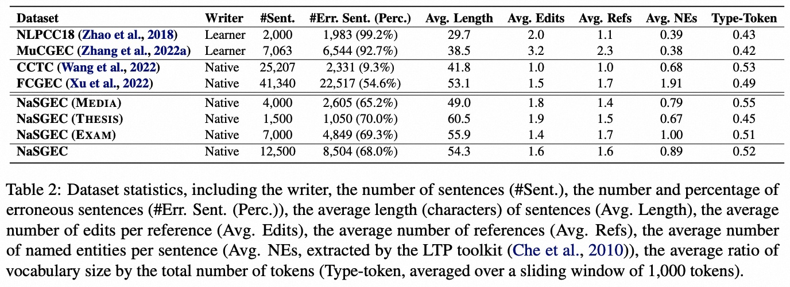

# NaSGEC: Multi-Domain Chinese Grammatical Error Correction Dataset for Native Speaker Texts

[中文](./README.md)|[English](./README.en.md)
## 简介
本文提出了首个多领域中文母语纠错数据集NaSGEC，包含3个领域的真实病句：社交媒体(Media)，学术写作(Thesis)和语文考试(Exam)，旨在推动中文语法纠错(CGEC)的跨领域(Cross-domain)研究。每个病句由双人独立标注+专家审查，从而提供多个高质量参考修改。

同时，我们基于中文BART训练了一系列高质量基准CGEC模型，主要包括：1) 基于高质量人工标注训练数据(Lang8+HSK)；2) 基于超大规模(>1亿)母语文本自动构造的训练数据。

此外，我们也使用人工标注的NaSGEC数据集对上述模型进行领域内微调，从而构建针对特定领域的先进中文语法纠错模型。

## NaSGEC数据集
NaSGEC数据集主要包含3个中文母语领域的12,500个句子及其对应的修改结果，这三个领域分别为：

+ **社交媒体(NaSGEC-Media)**：从微信公众号文章中获取的4000句；
+ **学术写作(NaSGEC-Thesis)**：从计算机专业本科生毕业论文中获取的1500句；
+ **语文考试(NaSGEC-Exam)**：从语文考试试卷中获取的7000句；

主要的数据统计指标如下表所示：


更多详细数据介绍和跨领域分析，请参考我们的论文。

*请注意：数据集将在完善后尽快发布。*

## Benchmark纠错模型
### 实验环境
本文所提出的模型基于`SynGEC`代码库开发，实验环境安装如下所示:

```
git clone git@github.com:HillZhang1999/NaSGEC.git
git submodule update --recursive --remote --force
conda create -n nasgec python==3.8
conda activate nasgec
pip install -r requirements.txt
python -m spacy download en
cd ./SynGEC/src/src_syngec/fairseq-0.10.2
pip install --editable ./
```

### 模型使用
我们开源了如下5个中文纠错模型，分别适用于不同的领域：
| 模型 | 链接 | 描述 |
| :------- | :---------: | :---------: |
| **real_learner_bart_CGEC** | [Google Drive](https://drive.google.com/file/d/1AamhBi6vJ8RVzzHtr43Uaoqrm7_vPpuB/view?usp=share_link) | 伪母语数据预训练，真实二语者数据微调，适合二语者文本和病句题 |
| **pseudo_native_bart_CGEC** | [Google Drive](https://drive.google.com/file/d/1dKbrej1Eh_M1DFqtCvvSqso0QUUn9EvC/view?usp=share_link) | 使用伪母语数据训练的模型，适合通用母语写作场景 |
| **pseudo_native_bart_CGEC_media** | [Google Drive](https://drive.google.com/file/d/17dSnSEPq-eyWZ-Uck4G6fO8XwjNfxmDi/view?usp=share_link) | 伪母语数据预训练，NaSGEC-Media微调，适合日常写作 |
| **pseudo_native_bart_CGEC_thesis** | [Google Drive](https://drive.google.com/file/d/1J-BFDSxV4eQ2JvFEXdvI2AktZOxNd8rq/view?usp=share_link) | 伪母语数据预训练，NaSGEC-Thesis微调，适合学术写作 |
| **real_learner_bart_CGEC_exam** | [Google Drive](https://drive.google.com/file/d/1iQ0i7JMNXyoKjd5BdAfIPGg3QBLr9Lr3/view?usp=share_link) | 真实二语者数据预训练，NaSGEC-Exam微调，适合纠正语病错误 |

模型下载后放入`./models`目录，具体的推理方法可以参考`./bash/generate.sh`。
同时，用户也可以继续对上述模型进行微调训练，方法可以参考`./bash/finetune.sh`。

除了上述Fairseq版本，我们也支持`HuggingFace transformers`一键调用我们的模型进行推理，使用方式如下所示：

```
from transformers import BertTokenizer, BartForConditionalGeneration, Text2TextGenerationPipeline
tokenizer = BertTokenizer.from_pretrained("/mnt/nas_alinlp/zuyi.bzy/zhangyue/NaSGEC/models/real_learner_bart_CGEC")
model = BartForConditionalGeneration.from_pretrained("/mnt/nas_alinlp/zuyi.bzy/zhangyue/NaSGEC/models/real_learner_bart_CGEC")
encoded_input = tokenizer(["北京是中国的都。", "他说：”我最爱的运动是打蓝球“", "我每天大约喝5次水左右。", "今天，我非常开开心。"], return_tensors="pt", padding=True, truncation=True)
if "token_type_ids" in encoded_input:
    del encoded_input["token_type_ids"]
output = model.generate(**encoded_input)
print(tokenizer.batch_decode(output, skip_special_tokens=True))
```

Hugging Face模型链接为：
| 模型 | 链接 |
| :------- | :---------: |
| **HillZhang/real_learner_bart_CGEC** | [HuggingFace](https://huggingface.co/HillZhang/real_learner_bart_CGEC)|
| **HillZhang/pseudo_native_bart_CGEC** | [HuggingFace](https://huggingface.co/HillZhang/pseudo_native_bart_CGEC)|
| **HillZhang/pseudo_native_bart_CGEC_media** | [HuggingFace](https://huggingface.co/HillZhang/pseudo_native_bart_CGEC_media) |
| **HillZhang/pseudo_native_bart_CGEC_thesis** | [HuggingFace](https://huggingface.co/HillZhang/pseudo_native_bart_CGEC_thesis) |
| **HillZhang/real_learner_bart_CGEC_exam** | [HuggingFace](https://huggingface.co/HillZhang/real_learner_bart_CGEC_exam) |

**Hugging Face版本是由Fairseq训练的权重通过脚本转换而来，所以性能可能存在一些差异。**

### 效果评估
本文使用的Metric基于[MuCGEC](https://github.com/HillZhang1999/MuCGEC)工作提出的**ChERRANT**工具，主要计算字级别的Precision/Recall/F_0.5指标，具体使用方法可以参考[[Link]](https://github.com/HillZhang1999/MuCGEC/tree/main/scorers/ChERRANT)。后续我们会提供在线评测网站。

此外，我们的模型在NLPCC18/MuCGEC等前人数据集上也能取得SOTA的性能。

## 引用

如果您认为我们的工作对您的工作有帮助，请引用我们的论文：
NaSGEC: a Multi-Domain Chinese Grammatical Error Correction Dataset from Native Speaker Texts (Accepted by ACL2023 Findings) [PDF]()

```
@inproceedings{zhang-etal-2023-nasgec,
    title = "{Na}{SGEC}: a Multi-Domain Chinese Grammatical Error Correction Dataset from Native Speaker Texts",
    author = "Zhang, Yue  and
      Zhang, Bo  and
      Jiang, Haochen  and
      Li, Zhenghua  and
      Li, Chen  and
      Huang, Fei  and
      Zhang, Min"
    booktitle = "Findings of ACL",
    year = "2023"
    }
```

## 联系
如果您在使用我们的数据集及代码的过程中遇到了任何问题，可联系 hillzhang1999@qq.com。